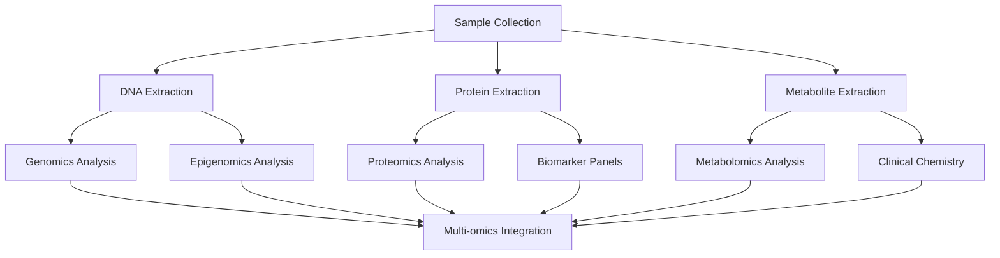

# BHARAT Study Multi-Omics Analysis Forms Guide

This guide provides comprehensive documentation for the multi-omics analysis forms implemented for the BHARAT Study in OpenSpecimen.

## Overview

The BHARAT Study employs cutting-edge multi-omics approaches to understand aging biomarkers in the Indian population. This system tracks the complete analytical pipeline from DNA extraction through final biomarker results.

### Analysis Pipeline

```
Sample Collection
├── DNA Extraction
│   ├── Genomics Analysis (WGS, WES, Arrays)
│   └── Epigenomics Analysis (Methylation, Clocks)
├── Protein Extraction
│   ├── Proteomics Analysis (MS/MS)
│   └── Biomarker Panels (Targeted assays)
└── Metabolite Extraction
    ├── Metabolomics Analysis (LC-MS)
    └── Clinical Chemistry (Standard markers)
```

## Multi-Omics Forms

### 1. DNA Extraction Form

**Purpose**: Track DNA extraction quality and yield for downstream genomics and epigenomics analysis.

**Key Fields**:
- **Sample ID**: BHARAT specimen identifier with format validation
- **Extraction Date**: Date of DNA extraction (cannot be future date)
- **Method**: Standardized extraction protocols (Qiagen, Promega, etc.)
- **Kit Lot Number**: Traceability for reagent lots
- **Technician**: User performing extraction
- **Yield**: DNA concentration (ng/μl, range: 0-5000)
- **Volume**: Total extracted volume (μl, range: 0-200)
- **260/280 Ratio**: Protein contamination assessment (1.6-2.1)
- **260/230 Ratio**: Organic contamination assessment (1.8-2.4)
- **QC Status**: Pass/Fail/Repeat determination

**Quality Thresholds**:
```
Acceptable DNA Quality:
- Yield: ≥10 ng/μl
- 260/280 ratio: 1.8-2.0 (optimal)
- 260/230 ratio: 2.0-2.2 (optimal)
- Volume: ≥50 μl for multiple analyses
```

**Usage Example**:
```
Sample: BHARAT-AG3-P0234-V0-BLD01
Method: Qiagen DNeasy Blood & Tissue Kit
Yield: 45.8 ng/μl
Volume: 100 μl
260/280: 1.85 (✅ Pass)
260/230: 2.1 (✅ Pass)
QC Status: Pass → Proceed to genomics/epigenomics
```

### 2. Genomics Analysis Form

**Purpose**: Track whole genome sequencing, exome sequencing, and array-based genomics analysis.

**Key Fields**:
- **Sequencing Platform**: Illumina NovaSeq, HiSeq, PacBio, ONT
- **Library Prep Method**: TruSeq, Nextera, SMRTbell, etc.
- **Sequencing Depth**: Coverage depth (X, typically 30X for WGS)
- **Read Length**: Base pairs per read (50-500 bp)
- **Q30 Percentage**: Quality score ≥30 for 85%+ of bases
- **Total Reads**: Million reads generated
- **File Paths**: FASTQ, BAM file locations
- **Pipeline Version**: Analysis software version
- **Reference Genome**: GRCh38/hg38, GRCh37/hg19, T2T-CHM13

**Quality Thresholds**:
```
WGS Quality Standards:
- Sequencing Depth: ≥30X
- Q30 Percentage: ≥85%
- Total Reads: ≥800M for 30X coverage
- Mapping Rate: ≥95%
```

**Analysis Workflows**:
```
Whole Genome Sequencing (WGS):
├── Library Prep: TruSeq DNA PCR-Free
├── Sequencing: NovaSeq 6000, 2×150bp
├── Target Depth: 30X coverage
└── Analysis: GATK Best Practices

Exome Sequencing (WES):
├── Library Prep: SureSelect Human All Exon
├── Sequencing: NovaSeq 6000, 2×100bp
├── Target Depth: 100X coverage
└── Analysis: Exome-focused pipeline
```

### 3. Proteomics Analysis Form

**Purpose**: Track mass spectrometry-based protein identification and quantification.

**Key Fields**:
- **MS Platform**: Thermo Orbitrap, Waters Synapt, Agilent Q-TOF
- **Sample Prep**: In-solution digestion, FASP, SP3, TMT labeling
- **Protein Concentration**: Starting material (μg/μl)
- **Proteins Identified**: Total unique proteins detected
- **Unique Peptides**: Peptide count for identification confidence
- **Search Database**: UniProt SwissProt, TrEMBL, RefSeq
- **FDR Threshold**: False discovery rate (typically 1%)
- **Search Engine**: MaxQuant, Proteome Discoverer, Mascot

**Quality Thresholds**:
```
Proteomics Quality Standards:
- Proteins Identified: ≥1000 (blood plasma)
- Unique Peptides: ≥5000
- FDR Threshold: ≤1%
- Missing Values: <20% across samples
```

**Analysis Types**:
```
Label-Free Quantification (LFQ):
├── Sample Prep: In-solution trypsin digestion
├── LC-MS/MS: 120-minute gradient
├── Search: MaxQuant with match-between-runs
└── Quantification: LFQ intensities

TMT Multiplexed Quantification:
├── Sample Prep: TMT 11-plex labeling
├── LC-MS/MS: SPS-MS3 method
├── Search: Proteome Discoverer
└── Quantification: Reporter ion intensities
```

### 4. Metabolomics Analysis Form

**Purpose**: Track LC-MS/MS-based metabolite detection and quantification.

**Key Fields**:
- **Analysis Type**: Targeted, Untargeted, Semi-targeted
- **LC-MS Method**: HILIC, C18, Lipidyzer protocols
- **Instrument Platform**: Q Exactive, Triple Quad, Q-TOF
- **Metabolites Detected**: Total features or known metabolites
- **Internal Standards**: Quality control compounds
- **Batch Information**: Processing batch tracking
- **QC Performance**: Coefficient of variation (%CV)
- **Peak Quality**: Manual or automated quality scoring
- **Data Processing**: Software used for analysis

**Quality Thresholds**:
```
Metabolomics Quality Standards:
- QC Sample CV: <20% for targeted, <30% for untargeted
- Peak Quality Score: ≥7/10
- Internal Standard Recovery: 80-120%
- Blank Sample Contamination: <5% of signal
```

**Analysis Methods**:
```
Untargeted Metabolomics:
├── HILIC-pos: Polar metabolites, positive mode
├── HILIC-neg: Polar metabolites, negative mode
├── C18-pos: Lipids and lipophilic compounds
└── Data Processing: Peak picking, alignment, annotation

Targeted Metabolomics:
├── Selected Reaction Monitoring (SRM)
├── Known metabolite standards
├── Calibration curves for quantification
└── High sensitivity and specificity
```

### 5. Epigenomics Analysis Form

**Purpose**: Track DNA methylation analysis and epigenetic age calculation.

**Key Fields**:
- **Analysis Type**: WGBS, RRBS, 850K Array, ChIP-seq, ATAC-seq
- **Platform**: Illumina EPIC 850K, NovaSeq (WGBS)
- **Bisulfite Conversion**: Efficiency percentage (≥95%)
- **CpG Sites Covered**: Total methylation sites analyzed
- **Mean Coverage**: Sequencing depth for WGBS (≥5X)
- **Epigenetic Age**: Predicted biological age in years
- **Age Acceleration**: Difference from chronological age
- **Clock Type**: Horvath, Hannum, PhenoAge, GrimAge, DunedinPACE

**Quality Thresholds**:
```
Epigenomics Quality Standards:
- Bisulfite Conversion: ≥98%
- CpG Sites Covered: ≥500K (850K array), ≥20M (WGBS)
- Mean Coverage: ≥10X (WGBS)
- Detection P-value: <0.01 (arrays)
```

**Epigenetic Clocks**:
```
First Generation Clocks:
├── Horvath Clock (2013): 353 CpGs, multi-tissue
└── Hannum Clock (2013): 71 CpGs, blood-specific

Second Generation Clocks:
├── PhenoAge (2018): Mortality prediction
├── GrimAge (2019): Healthspan prediction
└── DunedinPACE (2022): Pace of aging
```

### 6. Biomarker Panel Form

**Purpose**: Track targeted biomarker assays for aging, inflammation, and metabolic health.

**Key Fields**:
- **Panel Type**: Inflammation, Metabolic Health, Aging, Organ Function
- **Assay Platform**: Luminex, ELISA, ECL, Flow Cytometry, qPCR
- **Individual Biomarkers**: CRP, IL-6, TNF-α, glucose, HbA1c, etc.
- **Reference Ranges**: Age and population-specific normal ranges
- **Units**: Standardized measurement units
- **Quality Control**: Internal controls and calibrators

**Standard Panels**:

#### Inflammation Panel
```
Biomarker              Range           Units      Reference
C-Reactive Protein     0-10            mg/L       <3 (normal)
Interleukin-6          0-10            pg/ml      <5 (normal)
TNF-α                  0-20            pg/ml      <8 (normal)
Interleukin-1β         0-5             pg/ml      <2 (normal)
```

#### Metabolic Health Panel
```
Biomarker              Range           Units      Reference
Fasting Glucose        70-100          mg/dl      70-100 (normal)
HbA1c                  4-6             %          <5.7 (normal)
Insulin                2-25            μIU/ml     2-25 (normal)
Total Cholesterol      150-300         mg/dl      <200 (optimal)
HDL Cholesterol        30-100          mg/dl      >40♂/>50♀
LDL Cholesterol        50-200          mg/dl      <100 (optimal)
Triglycerides          50-400          mg/dl      <150 (normal)
```

#### Aging Biomarkers Panel
```
Biomarker              Method          Units      Notes
Telomere Length        qPCR            T/S ratio  Relative to reference
p16INK4a Expression   qPCR            ΔΔCt       Senescence marker
GDF15                  ELISA           pg/ml      200-1800 (normal)
Advanced Glycation     Fluorescence    AGE units  Protein modification
```

#### Organ Function Panel
```
System    Biomarker           Range         Units      Reference
Kidney    Cystatin C          0.5-1.5       mg/L       <1.0 (normal)
          eGFR                >60           ml/min     >90 (normal)
Liver     ALT                 5-50          U/L        <40 (normal)
          AST                 5-50          U/L        <40 (normal)
          Albumin             3.5-5.5       g/dl       3.5-5.0 (normal)
Heart     NT-proBNP           0-400         pg/ml      <125 (normal)
          Troponin            0-0.1         ng/ml      <0.04 (normal)
Thyroid   TSH                 0.5-5.0       mIU/L      0.4-4.0 (normal)
          Free T4             0.8-2.0       ng/dl      0.9-1.7 (normal)
```

## Workflow Integration

### Analysis Dependencies



### Quality Control Workflow

```
Sample QC → Extraction QC → Analysis QC → Data QC → Results QC
    ↓            ↓             ↓           ↓          ↓
   Pass        Pass          Pass        Pass       Release
    ↓            ↓             ↓           ↓          ↓
   Fail        Fail          Fail        Fail      Repeat
    ↓            ↓             ↓           ↓
  Reject     Re-extract    Re-analyze  Re-process
```

## Data Management

### File Organization

```
/data/bharat-study/
├── genomics/
│   ├── fastq/
│   ├── bam/
│   ├── vcf/
│   └── analysis/
├── proteomics/
│   ├── raw/
│   ├── processed/
│   └── results/
├── metabolomics/
│   ├── raw/
│   ├── processed/
│   └── results/
├── epigenomics/
│   ├── methylation/
│   ├── clocks/
│   └── analysis/
└── biomarkers/
    ├── raw-data/
    └── processed/
```

### Data Integration Points

1. **Sample Tracking**: Links all analyses to original specimen
2. **Quality Metrics**: Standardized QC across all platforms
3. **Batch Effects**: Tracking for statistical adjustment
4. **Time Points**: Longitudinal analysis capabilities
5. **Multi-omics**: Integration across data types

## Implementation Files

### Setup Scripts
```bash
# 1. Create multi-omics forms
python setup-bharat-multi-omics-forms.py

# 2. Test form functionality
python test-bharat-multi-omics-forms.py
```

### Configuration Files
- **`bharat-multi-omics-forms.json`** - Form definitions and validation rules
- **`setup-bharat-multi-omics-forms.py`** - Automated setup script
- **`test-bharat-multi-omics-forms.py`** - Comprehensive testing suite

## User Workflows

### 1. DNA Extraction Workflow
1. Select specimens for DNA extraction
2. Record extraction method and reagent lots
3. Perform extraction according to SOP
4. Measure yield and purity (NanoDrop/Qubit)
5. Record results in DNA Extraction Form
6. Determine QC status (Pass/Fail/Repeat)
7. Store DNA samples in designated freezer

### 2. Genomics Analysis Workflow
1. Select DNA samples passing QC
2. Prepare sequencing libraries
3. Perform sequencing on designated platform
4. Monitor run quality metrics
5. Process raw data through analysis pipeline
6. Record results in Genomics Analysis Form
7. Store data files in designated locations

### 3. Proteomics Analysis Workflow
1. Select plasma/serum samples
2. Determine protein concentration
3. Perform sample preparation (digestion/labeling)
4. Run LC-MS/MS analysis
5. Process data through search engines
6. Record results in Proteomics Analysis Form
7. Archive raw and processed data

### 4. Metabolomics Analysis Workflow
1. Select appropriate sample types
2. Prepare samples for LC-MS analysis
3. Run targeted or untargeted methods
4. Process data for metabolite identification
5. Perform quality control assessment
6. Record results in Metabolomics Analysis Form
7. Archive data and maintain batch information

### 5. Epigenomics Analysis Workflow
1. Select DNA samples for methylation analysis
2. Perform bisulfite conversion or array processing
3. Run sequencing or array analysis
4. Process methylation data
5. Calculate epigenetic ages using standard clocks
6. Record results in Epigenomics Analysis Form
7. Archive methylation data files

### 6. Biomarker Panel Workflow
1. Select appropriate sample types (plasma/serum)
2. Prepare samples for targeted assays
3. Run biomarker assays (ELISA, Luminex, etc.)
4. Calculate concentrations using standard curves
5. Compare to reference ranges
6. Record results in Biomarker Panel Form
7. Flag abnormal values for review

## Quality Control

### Form Validation
- Sample ID format checking
- Date validation (no future dates)
- Numeric range validation
- Required field enforcement
- Quality threshold alerts

### Data Integrity
- Automated backup procedures
- Version control for analysis pipelines
- Audit trails for all data changes
- Regular data validation checks
- Cross-platform data consistency

### Performance Monitoring
- Form completion rates
- Analysis turnaround times
- Quality control metrics
- Error rate tracking
- User training needs assessment

## Training and Support

### User Training Topics
1. **Form Navigation**: How to access and complete forms
2. **Data Entry**: Best practices for accurate data entry
3. **Quality Control**: Understanding QC thresholds and actions
4. **Workflow Integration**: How forms connect in analysis pipeline
5. **Troubleshooting**: Common issues and solutions

### Support Resources
- **Technical Support**: openspecimen-support@longevityindia.org
- **Study Coordination**: bharat-study@longevityindia.org
- **Emergency Support**: +91-XXXXXXXXXX (24/7)

### Best Practices
1. **Consistent Data Entry**: Use standardized terminology
2. **Timely Recording**: Enter data immediately after analysis
3. **Quality Control**: Review data before submission
4. **Backup Procedures**: Maintain local records as backup
5. **Documentation**: Keep detailed analysis notes

---

**Document Version**: 1.0  
**Last Updated**: January 2025  
**Author**: Longevity India BHARAT Study Team